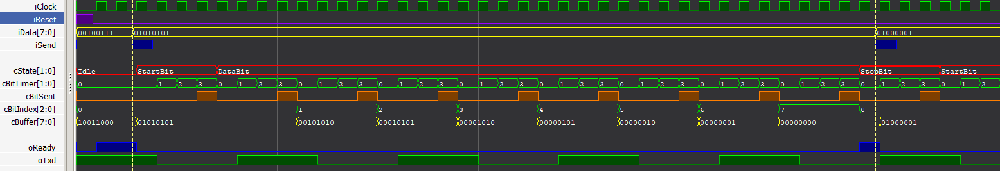
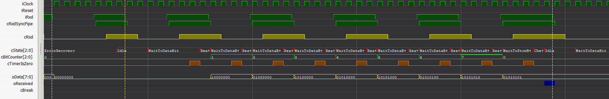

# BasicUART

Small light-weight synthetisable implementation of UART in Verilog. It uses fixed serial data format 8-N-1 (8 data bits, 1 stop bit, without parity check and without hardware flow control). Baud rate can be parametrized from arbitrary low value up to 1/3 of system clock for transmitter and 1/4 for receiver. On tested FPGA (from iCE40 family) each of the modules uses about 40 LUTs. The modules use only generic Verilog so they can be used on virtually any FPGA. 

The design was tested on two boards [TinyFPGA-BX](https://tinyfpga.com) with iCE40LP8K chip and [Alchitry-Cu](https://alchitry.com/) with iCE40-HX8K chip. For the low-power LP8K variant of the chip the P&R tool nextpnr declared a maximum clock frequency about 150Mhz for the more powerfull HX8K variant about 220Mhz. 

Design is synthesizable in the open source toolchain yosys/nextpnr/icestorm same as in the proprietary iCEcube2 from Lattice. Serial communication was tested with USB-to-Serial adapters based on CP2104 and FT2232H chips with baud rates from 300 bauds to 12Mbit.


## Serial Transmitter

```verilog
module SerialTransmitter #(
  parameter pClockFrequency = 16000000,  
    //^ System clock frequency.
      
  parameter pBaudRate = 115200     
    //^ Serial output baud rate (..., 9600, 115200, 2000000, ...)
    //^ Can be value from arbitrary low to max 1/3 of pClockFrequency.
)(
  input wire iClock,       
    //^ System clock with frequency specified in the parameter pClockFrequency.
      
  input wire [7:0] iData,  
    //^ Data to send (have to be valid first clock after set iSend to 1).
      
  input wire iSend,        
    //^ Set to 1 for at least one clock cycle for start the sending.
      
  output wire oReady,   
    //^ Signalizes readiness to take over next byte to send.
      
  output wire oTxd          
    //^ Serial data output with baudrate specified in the parameter pBaudRate.
    
  `ifdef GlobalReset
  ,input wire iReset
    //^ Reset module to initial state (reset is synchronized with posedge, set to 1 for one clock is enough).
    //^ Module can begin transmit data in next clock tick after the iReset was set to 0.
  `endif
);
```

Set parameters `pClockFrequency` and `pBaudRate` to requirements of your design (`pBaudRate` can be 
  max 1/3 of `pClockFrequency`). For high baud rates check values of parametrization report `pInaccuracyPerFrame` and `pInaccuracyThreshhold` to ensure that `clock frequency / baud rate` ratio generates acceptable inaccuracy of the frame length. Generally `pInaccuracyPerFrame` have to be less than `pInaccuracyThreshhold`. For ideal ratio is `pInaccuracyPerFrame = 0`.

For send a byte set `iData` to required value and set `iSend` to 1 for at least one clock cycle. The module takes over data into its own buffer and starts transmitting. The `iData` value has to be valid only for first clock tick after `iSend` was asserted. The signal `oReady` indicates readiness to take over next byte for send. The signal is set to 0 after take over byte to send and during transmitting the start and data bits. After last data bit sent the `oReady` signal is immediatelly set to 1 so a next byte to send can be pass already during transmitting stop bit of previous frame. Because of that there is not any delay before transmitting the next byte.




## Serial Receiver

```verilog
module SerialReceiver #(
  parameter pClockFrequency = 16000000,  
    //^ System clock frequency.

  parameter pBaudRate = 115200   
    //^ Serial input baud rate (..., 9600, 115200, 2000000, ...)
    //^ Can be value from arbitrary low to max 1/4 of pClockFrequency.
)(
  input wire iClock,             
    //^ System clock with frequency specified in the parameter pClockFrequency.

  input wire iRxd,               
    //^ Serial data input with baud rate specified in pBaudRate parameter
      
  output wire [7:0] oData,              
    //^ Received data byte (valid for one clock when oReceived is 1).
      
  output wire oReceived,      
    //^ Signalizes (for one clock) received valid data in oData.
      
  output wire oBreak
    //^ Signalizes (for one clock) break or missing stop bit error in receiving serial data. 
      
  `ifdef GlobalReset
  ,input wire iReset
    //^ Reset module to initial state (reset is synchronized with posedge, set to 1 for one clock is enough).
    //^ After reset the module waits for transition iRxd to 1 and then it begins to wait for serial data.
  `endif
);

```

Set parameters `pClockFrequency` and `pBaudRate` to requirements of your design (`pBaudRate` can be max 1/4 of 
  `pClockFrequency`). For high baud rates check values of parametrization report `pInaccuracyPerFrame` and 
  `pInaccuracyThreshhold` to ensure that `clock frequency / baud rate` ratio generates acceptable inaccuracy of frame length. Generally `pInaccuracyPerFrame` have to be less than `pInaccuracyThreshhold`. For ideal ratio is `pInaccuracyPerFrame = 0`.
  
Each time receiver receives one valid frame (byte) it makes it available in `oData` and set `oReceived` to 1 for one clock. If a break or a missing stop bit error occurs in receiving serial data `oBreak` is set to 1 for one clock.

Module supports automatic power on reset (after load bitstream to the FPGA), explicit reset over `iReset` signal or both of them. Mode of reset is determined by preprocessor symbols GlobalReset and PowerOnReset. Edit the `Global.inc` file to select reset modes.




## License

Design is provided under MIT license.  
